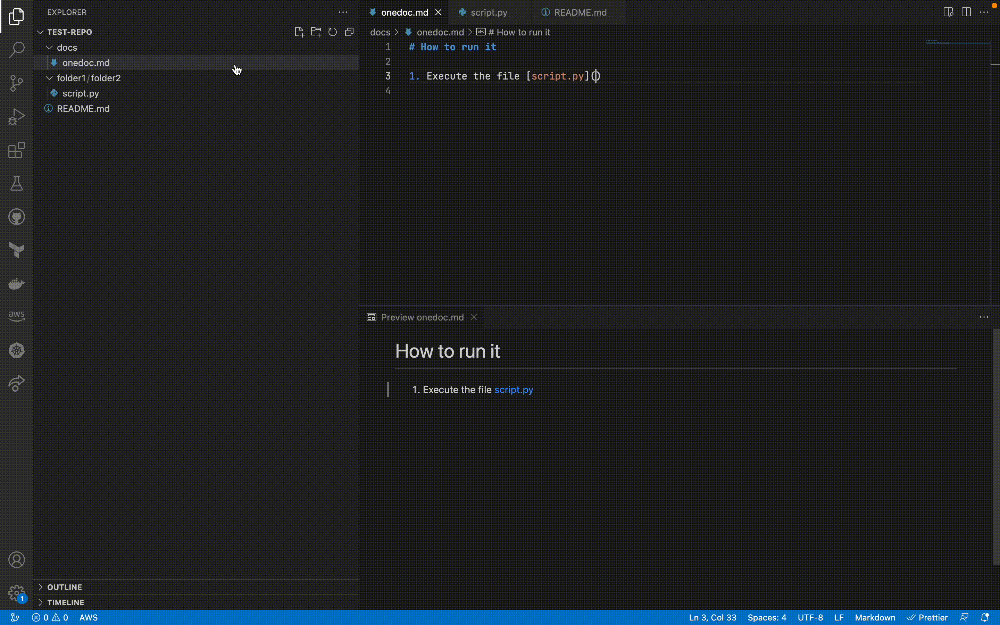

# relativiser

Simple extension for vs code that copies to the clipboard the relative path between two files selected on the file explorer.

## How to use it

1. Select a file on the explorer
2. Select a second file on the explorer
3. Right click on the second file
4. Click on "Get relative path" and the relative path to the second file from the first one is automatically copied to the clipboard.

### Example

